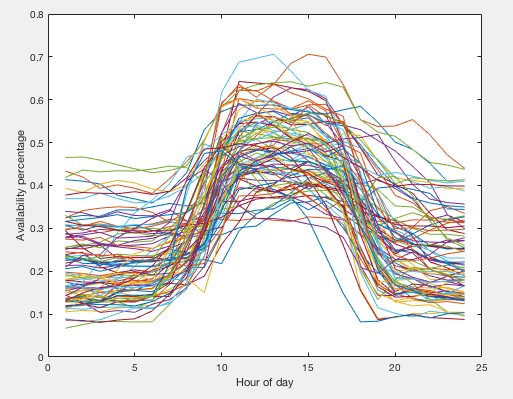
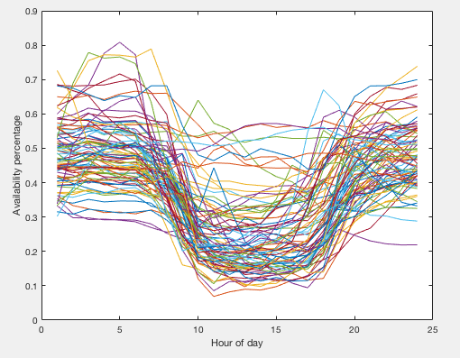
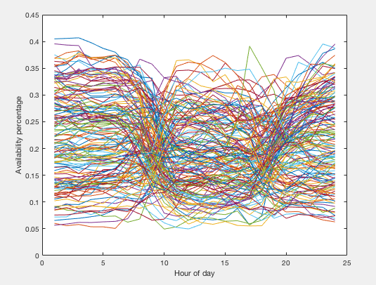

# citibikestations
I downloaded data on the number of available bikes and number of total docks at each Citi bike station during the month of March 2015 from theopenbus.com. Then I did my best to implement Urbica's description of how they clustered Citi bike stations using K-means (see https://medium.com/@Urbica.co/city-bike-rebalanced-92ac61a867c7). I used R to organize the data from The Open Bus and then I transferred it to Matlab where I implemented K-means. Like Urbica I chose 3 clusters, and below are plots for each cluster, with availability percentage of bikes on the y-axis and the hour of the day on the x-axis.

High availability during the middle of the day

Low availability during the middle of the day

Lower availability throughout the day

